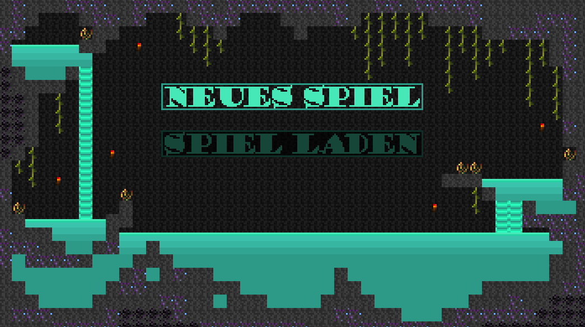
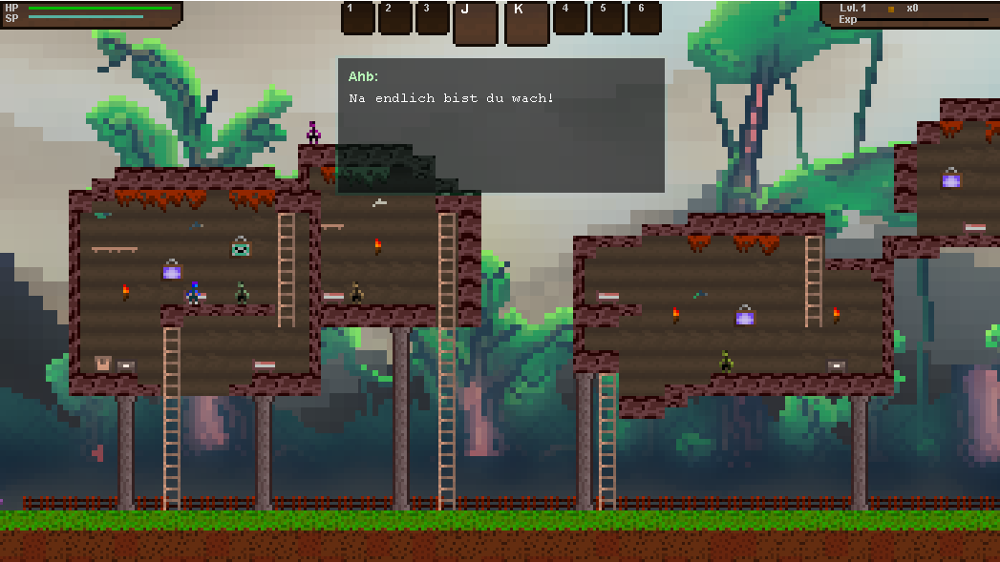
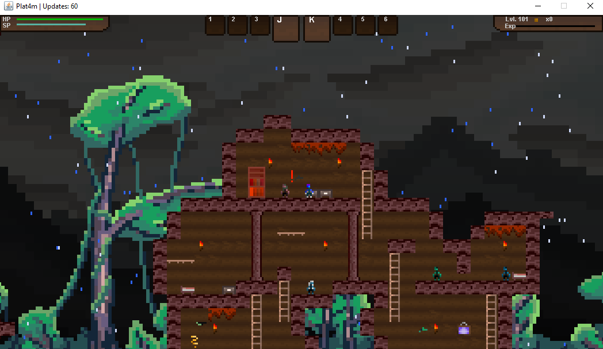
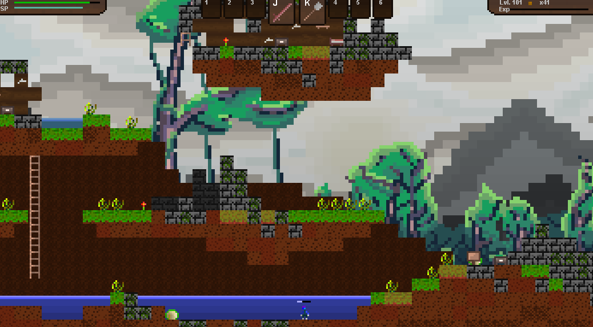
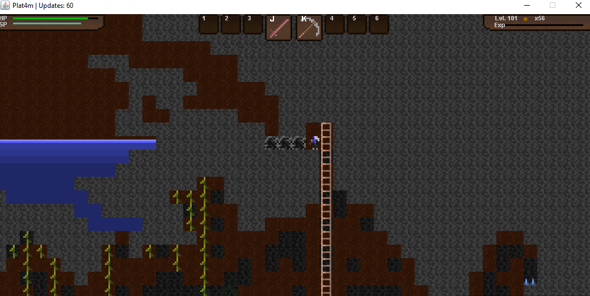

# Plat4m

Plat4m is a small and unfinished platformer I developed in Java during my second and third semester (2016-17).
It features a pixelated environment in combination with a fast-paced gameplay. With a development time of +1 year (mostly during holidays) 
Plat4m is the biggest game I have developed by now. I commenced with some rough ideas of
designing a funny 2D pixel style platformer, but these ideas evolved to something much more immense. In 2021 I finally added this project
to my git account.

The game might not be finished, but this has never been my intention. The main reason behind the development process was
to learn Object Oriented Programming (OOP). Consequently, Plat4m could be regarded as long-term study project.

## How to Play?
Either download the latest release or run the [Main Function](src/com/t4khosu/Platformer/Game.java) in your Java IDE. The only requirement is
Java JDK >= v11.

## Controls?
Because the controls are not really explained, here is a comprehensive manual:
* **Arrow Keys**. Move, jump and crawl.
* **Space**. Interact (with NPCs, chests, ...)
* **E**. Open inventory.
* **H**. Harvest.

## What can I expect?
Since the game is unfinished and I was not as experienced in 2016 as I am now, there are quite a few (known) bugs. Furthermore, I thought it would be easier
to implement it in German (as I am from Germany); so, for my non-German folks this game might be unplayable.
Oh, and before I forget it: the "save" function does not really work. It stores your location (in case of death) for the current session, but once you restart the game any
progress is lost.

## Learnings
I love game programming, but looking back I encountered some major flaws.
1. **The pixel style**. While there are many games which look stunning with a pixel graphic, the different levels of detail and color in Plat4m make some chararacters get completely lost in the environment.
2. **Controls**. The character moves way too fast + the jump height can not be controlled by pressing the jump button longer / shorter.
3. **Scope**. For a single person to finish something like this while studying full time is nearly impossible. A better time management and clearer goals would have been beneficial.
4. **External Libraries**. I am really happy I didn't use any. This way I learned a lot! However, it is really hard to maintain this project any longer. Additionally, predefined functions as in Unity definitely would have helped.
5. **Fun**. Some gameplay elements are no fun. For example, the fast movement, the slow leveling, the lack of a menu settings, the lack of sound, ...

## Gameplay Screenshots

