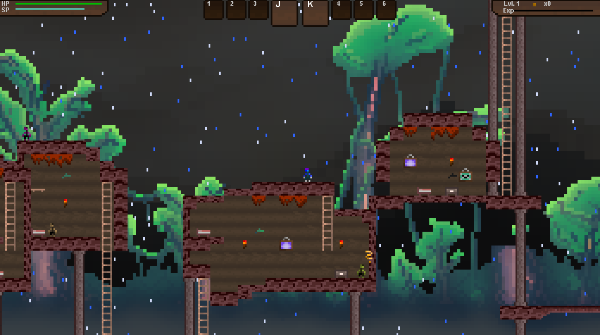
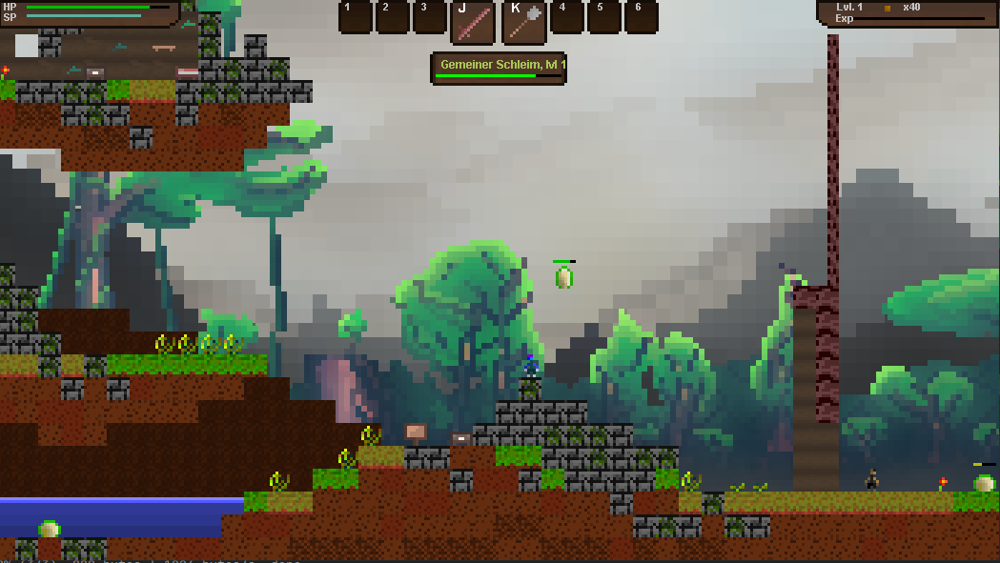

# Plat4m

This is one of the first (and biggest) games I have worked on so far. The development took a few months, and the game ist still unfinished.
I started this project to learn how OOP and game programming works.

## Setup
* Java >= v11
* Requirements: None (just run the main and enjoy the game)

## Warnings
Since this game is really old, many bugs will appear. Keep your expectations low!  
Saving does not work, either. Back then I didn't write tests, so ... I am scared to touch this code without spending hours and hours
of refactoring.  
Since I am from Germany, the in-game language is German.

## Learnings
I love game programming, but looking back I see some major flaws.
1. Color. FYI the blue person is the character you can control. Also the pixel sizes vary, which is a bit strange.
2. Controls. The character moves way too fast and jump height cannot be controlled.
3. Size. For a single person to finish something like this while working or having any kind of life is kind of impossible.
4. Libraries. I am really happy I didn't use any. This way I learned many things. However, it is really hard to maintain this project any longer and some predefined functions (like in Unity) definitely would have helped me.
5. Fun. Some stuff really is not fun. For example the fast movement or the ladder climbing.

## In Game Images

